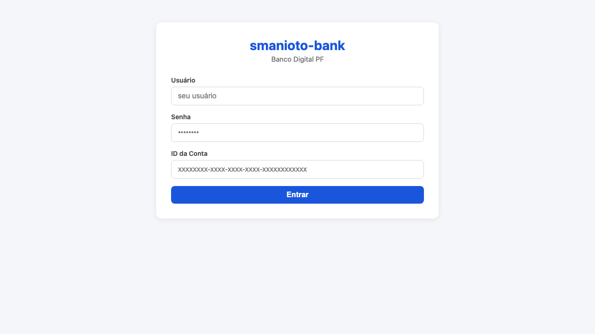
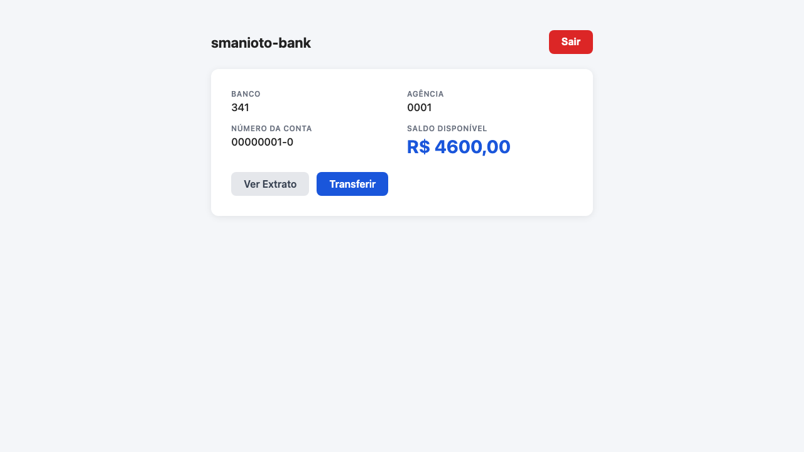
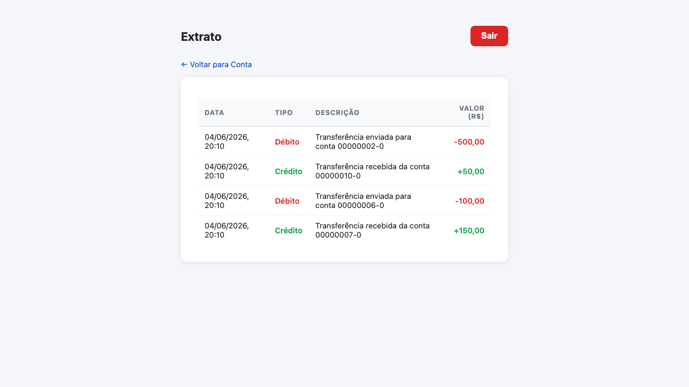
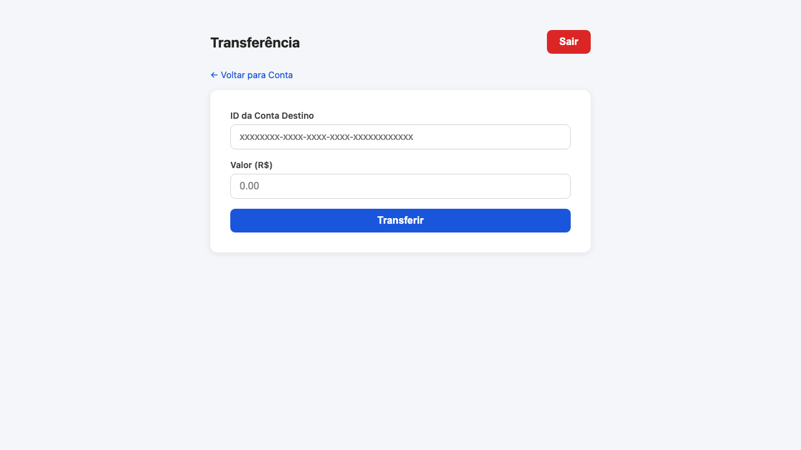

<div align="center">

# 🏦 smanioto-bank

**Banco digital para Pessoa Física**

Laboratório de aprendizado em **Spec-Driven Development (SDD)** com arquitetura de microserviços Java/Spring Boot e interface web vanilla.

[](https://openjdk.org/projects/jdk/17/)
[](https://spring.io/projects/spring-boot)
[](https://h2database.com)
[](https://jwt.io)
[](https://maven.apache.org)
[](https://developer.mozilla.org/docs/Web/JavaScript)

</div>

---

## 📋 Sumário

- [Visão Geral](#-visão-geral)
- [Interface](#-interface)
- [Arquitetura](#-arquitetura)
- [Pré-requisitos](#-pré-requisitos)
- [Início Rápido](#-início-rápido)
- [Consultando Logs](#-consultando-logs)
- [Referência da API](#-referência-da-api)
  - [Auth Service](#-auth-service--porta-8080)
  - [People Service](#-people-service--porta-8081)
  - [Accounts Service](#-accounts-service--porta-8082)
- [Fluxo Completo de Uso](#-fluxo-completo-de-uso)
- [Estrutura do Projeto](#-estrutura-do-projeto)
- [Fluxo de Desenvolvimento (SDD)](#-fluxo-de-desenvolvimento-sdd)
- [📖 Manual do Usuário](docs/manual-usuario.md)

---

## 🎯 Visão Geral

O **smanioto-bank** simula as operações essenciais de um banco digital para Pessoa Física:

| Funcionalidade | Descrição |
|---|---|
| 🔐 Autenticação | Cadastro de credenciais, login e validação via JWT |
| 👤 Clientes PF | Cadastro e consulta de clientes com CPF |
| 💰 Contas | Abertura de conta vinculada a um cliente |
| 📊 Extrato | Histórico completo de movimentações |
| 🔄 Transferência | Transferência atômica entre contas internas |
| 🌐 Interface Web | Frontend HTML/CSS/JS para operar tudo pelo navegador |

---

## 📸 Interface

| Login | Conta e Saldo |
|:---:|:---:|
|  |  |

| Extrato | Transferência |
|:---:|:---:|
|  |  |

---

## 🏗️ Arquitetura

```mermaid
graph TD
    Browser["🌐 Browser<br/>localhost:3000"]

    Browser -->|"POST /auth/login"| Auth
    Browser -->|"GET /accounts/{id}"| Accounts
    Browser -->|"GET /accounts/{id}/statement"| Accounts
    Browser -->|"POST /accounts/transfer"| Accounts

    subgraph Microserviços Java
        Auth["🔐 auth-service<br/>:8080"]
        People["👤 people-service<br/>:8081"]
        Accounts["💰 accounts-service<br/>:8082"]
    end

    Auth --> AuthDB[(H2<br/>authdb)]
    People --> PeopleDB[(H2<br/>peopledb)]
    Accounts --> AccountsDB[(H2 TCP<br/>accountsdb<br/>:9092)]

    subgraph Data Lake — Democratização
        GlueJob["⚙️ glue_job.py<br/>(PySpark local<br/>simula AWS Glue)"]
        Parquet[("📦 Parquet<br/>daily_statement/<br/>account_id / date")]
        QueryCLI["🔍 query_daily.py<br/>(consulta ad-hoc)"]
    end

    AccountsDB -->|"JDBC :9092"| GlueJob
    GlueJob -->|"overwrite"| Parquet
    Parquet -->|"pyarrow read"| QueryCLI
```

### Serviços

| Serviço | Porta | Responsabilidade |
|---|---|---|
| `auth-service` | **8080** | Cadastro de credenciais, login, emissão e validação de JWT |
| `people-service` | **8081** | Cadastro e consulta de clientes PF (CPF, nome, data de nascimento) |
| `accounts-service` | **8082** | Abertura de conta, consulta de saldo, extrato e transferências internas |
| `frontend` | **3000** | Interface web para operar todas as funcionalidades pelo navegador |
| `data-lake` | — | Job PySpark que lê o SOR via JDBC e gera Parquet diário |

> **Banco de dados:** cada serviço usa um banco H2 in-memory independente. O accounts-service expõe também um servidor H2 TCP (porta 9092) para que o Glue job local consuma os dados via JDBC.

### Camada de Democratização (Data Lake)

| Componente | Arquivo | Descrição |
|---|---|---|
| **Glue Job** | `services/data-lake/glue_job.py` | Lê `ACCOUNTS` e `MOVEMENTS` via JDBC, calcula visão diária e salva Parquet |
| **Query CLI** | `services/data-lake/query_daily.py` | Consulta os arquivos Parquet por conta e/ou data |
| **Runner** | `services/data-lake/run_job.sh` | Script de execução com verificação de dependências |

```
output/daily_statement/
  account_id=<uuid>/
    date=2026-06-04/
      part-00000-....parquet   ← opening_balance, closing_balance, créditos, débitos, lançamentos
```

**Para executar:**
```bash
cd services/data-lake
./run_job.sh                                       # gera os Parquet
python3 query_daily.py --list-accounts             # lista contas disponíveis
python3 query_daily.py --account <uuid>            # extrato diário completo
python3 query_daily.py --account <uuid> --date 2026-06-04
```

---

## ⚙️ Pré-requisitos

| Ferramenta | Versão mínima | Como verificar |
|---|---|---|
| Java (JDK) | **17** | `java -version` |
| Apache Maven | **3.9** | `mvn -version` |
| Python | **3.x** | `python3 --version` |

---

## 🚀 Início Rápido

### 1. Clone o repositório

```bash
git clone https://github.com/danielsmanioto/smanioto-bank.git
cd smanioto-bank
```

### 2. Suba tudo com um único comando

```bash
./start.sh
```

O script executa automaticamente:

1. ✅ Verifica pré-requisitos (Java, Maven, Python 3)
2. 📦 Compila os 3 serviços Java com Maven (`-DskipTests`)
3. 🚀 Inicia `auth-service`, `people-service` e `accounts-service` em background
4. ⏳ Aguarda 8 segundos para o Spring Boot inicializar
5. 🌐 Sobe o servidor do frontend na porta 3000
6. 📋 Exibe as URLs de acesso e o caminho dos logs

```
╔══════════════════════════════════════╗
║   ✅  Todos os serviços no ar!       ║
╚══════════════════════════════════════╝

  Frontend   → http://localhost:3000
  Auth       → http://localhost:8080/auth
  People     → http://localhost:8081/people
  Accounts   → http://localhost:8082/accounts

  Logs       → .logs/
  Para parar → ./stop.sh
```

### 3. Abra o banco no navegador

```
http://localhost:3000
```

> **Primeira vez?** Veja o [📖 Manual do Usuário](docs/manual-usuario.md) — ele explica passo a passo como criar sua conta, fazer login e realizar transferências.

### 4. Pare tudo quando terminar

```bash
./stop.sh
```

---

## 📖 Manual do Usuário

O frontend exige que a conta seja criada via API antes do primeiro acesso. O [Manual do Usuário](docs/manual-usuario.md) guia você pelos 7 passos:

1. Registrar credenciais (API)
2. Cadastrar perfil de cliente PF (API)
3. Abrir conta bancária (API) — **guarde o ID da conta**
4. Fazer login no frontend com usuário + senha + ID da conta
5. Ver saldo e dados da conta
6. Consultar extrato de movimentações
7. Realizar transferências entre contas

> **Atalho:** rode `./seed.sh` após o `./start.sh` para criar 10 usuários prontos (incluindo `admin/admin`) com saldo e extrato populados.

---

## 🔍 Consultando Logs

Os logs de todos os serviços ficam em `.logs/` e podem ser consultados com o script `logs.sh`.

### Comandos rápidos

```bash
# Últimas 50 linhas de todos os serviços
./logs.sh

# Seguir todos em tempo real (como tail -f nos 4 ao mesmo tempo)
./logs.sh -f

# Apenas erros e warnings de todos os serviços
./logs.sh -e

# Buscar texto/exceção em todos os logs
./logs.sh -g 'NullPointerException'

# Focar em um serviço específico
./logs.sh -s auth
./logs.sh -s people
./logs.sh -s accounts
./logs.sh -s frontend

# Combinar: seguir apenas erros do accounts-service
./logs.sh -s accounts -e -f

# Aumentar o histórico exibido
./logs.sh -n 200
```

### Opções disponíveis

| Opção | Descrição |
|---|---|
| `-f` | Seguir logs em tempo real (`tail -f` em todos) |
| `-n LINHAS` | Número de linhas por serviço (padrão: 50) |
| `-g TEXTO` | Filtrar por texto (grep) |
| `-s SERVIÇO` | Exibir apenas um serviço (`auth`, `people`, `accounts`, `frontend`) |
| `-e` | Mostrar apenas linhas de `ERROR`, `WARN` e `Exception` |

> **Dica de debug:** comece com `./logs.sh -e` para ver todos os erros de uma vez, depois use `./logs.sh -s <serviço> -f` para acompanhar o serviço problemático em tempo real.

---

## 📡 Referência da API

### 🔐 Auth Service — porta 8080

#### `POST /auth/register` — Cadastrar credenciais

```bash
curl -X POST http://localhost:8080/auth/register \
  -H "Content-Type: application/json" \
  -d '{"username": "joao", "password": "senha123"}'
```

**Resposta:** `201 Created` (sem corpo)

---

#### `POST /auth/login` — Login e geração de JWT

```bash
curl -X POST http://localhost:8080/auth/login \
  -H "Content-Type: application/json" \
  -d '{"username": "joao", "password": "senha123"}'
```

**Resposta:** `200 OK`
```json
{
  "token": "eyJhbGciOiJIUzI1NiIsInR5cCI6IkpXVCJ9...",
  "type": "Bearer"
}
```

---

#### `GET /auth/validate` — Validar token JWT

```bash
curl http://localhost:8080/auth/validate \
  -H "Authorization: Bearer {token}"
```

**Resposta:** `200 OK`
```json
{
  "valid": true,
  "username": "joao"
}
```

---

### 👤 People Service — porta 8081

#### `POST /people` — Cadastrar cliente PF

```bash
curl -X POST http://localhost:8081/people \
  -H "Content-Type: application/json" \
  -d '{
    "fullName": "João da Silva",
    "cpf": "12345678909",
    "email": "joao@email.com"
  }'
```

> **CPF:** somente 11 dígitos numéricos, sem pontos ou traço. Deve ser válido pelo algoritmo brasileiro.

**Resposta:** `201 Created`
```json
{
  "id": "a1b2c3d4-...",
  "fullName": "João da Silva",
  "cpf": "12345678909",
  "email": "joao@email.com"
}
```

---

#### `GET /people/{customerId}/exists` — Verificar existência de cliente

```bash
curl http://localhost:8081/people/a1b2c3d4-.../exists
```

**Resposta:** `200 OK`
```json
{
  "exists": true
}
```

---

### 💰 Accounts Service — porta 8082

#### `POST /accounts` — Abrir conta

> Requer que o `customerId` já exista no `people-service`.

```bash
curl -X POST http://localhost:8082/accounts \
  -H "Content-Type: application/json" \
  -d '{"customerId": "a1b2c3d4-..."}'
```

**Resposta:** `201 Created`
```json
{
  "id": "e5f6g7h8-...",
  "bank": "341",
  "branch": "0001",
  "accountNumber": "00012345-6",
  "balance": 0.00,
  "customerId": "a1b2c3d4-..."
}
```

---

#### `GET /accounts/{accountId}` — Consultar conta e saldo

```bash
curl http://localhost:8082/accounts/e5f6g7h8-...
```

**Resposta:** `200 OK`
```json
{
  "id": "e5f6g7h8-...",
  "bank": "341",
  "branch": "0001",
  "accountNumber": "00012345-6",
  "balance": 150.00,
  "customerId": "a1b2c3d4-..."
}
```

---

#### `GET /accounts/{accountId}/statement` — Extrato

```bash
curl http://localhost:8082/accounts/e5f6g7h8-.../statement
```

**Resposta:** `200 OK`
```json
[
  {
    "id": "mov-001",
    "type": "CREDIT",
    "amount": 500.00,
    "description": "Transferência recebida",
    "createdAt": "2026-06-04T10:30:00"
  },
  {
    "id": "mov-002",
    "type": "DEBIT",
    "amount": 350.00,
    "description": "Transferência enviada",
    "createdAt": "2026-06-04T11:00:00"
  }
]
```

---

#### `POST /accounts/transfer` — Realizar transferência

```bash
curl -X POST http://localhost:8082/accounts/transfer \
  -H "Content-Type: application/json" \
  -d '{
    "fromAccountId": "e5f6g7h8-...",
    "toAccountId":   "i9j0k1l2-...",
    "amount": 100.00
  }'
```

**Resposta:** `200 OK`
```json
{
  "fromAccountId": "e5f6g7h8-...",
  "toAccountId": "i9j0k1l2-...",
  "amount": 100.00,
  "transferredAt": "2026-06-04T12:00:00"
}
```

> **Regras:** saldo insuficiente retorna `400 Bad Request`. A operação é atômica — débito e crédito ocorrem juntos ou nenhum ocorre.

---

## 🔄 Fluxo Completo de Uso

Exemplo de ponta a ponta via `curl` para criar dois usuários e realizar uma transferência:

```bash
# 1. Registrar credenciais
curl -sX POST localhost:8080/auth/register -H "Content-Type: application/json" \
  -d '{"username":"alice","password":"alice123"}'

curl -sX POST localhost:8080/auth/register -H "Content-Type: application/json" \
  -d '{"username":"bob","password":"bob123"}'

# 2. Cadastrar clientes PF
ALICE_ID=$(curl -sX POST localhost:8081/people -H "Content-Type: application/json" \
  -d '{"name":"Alice","cpf":"111.444.777-35","birthDate":"1990-01-01"}' | jq -r '.id')

BOB_ID=$(curl -sX POST localhost:8081/people -H "Content-Type: application/json" \
  -d '{"name":"Bob","cpf":"000.000.001-91","birthDate":"1995-06-15"}' | jq -r '.id')

# 3. Abrir contas
ALICE_ACC=$(curl -sX POST localhost:8082/accounts -H "Content-Type: application/json" \
  -d "{\"customerId\":\"$ALICE_ID\"}" | jq -r '.id')

BOB_ACC=$(curl -sX POST localhost:8082/accounts -H "Content-Type: application/json" \
  -d "{\"customerId\":\"$BOB_ID\"}" | jq -r '.id')

# 4. Transferir (simulando saldo já presente no banco)
curl -sX POST localhost:8082/accounts/transfer -H "Content-Type: application/json" \
  -d "{\"fromAccountId\":\"$ALICE_ACC\",\"toAccountId\":\"$BOB_ACC\",\"amount\":50.00}"
```

---

## 📁 Estrutura do Projeto

```
smanioto-bank/
│
├── 📄 start.sh                        # Sobe todos os serviços com um comando
├── 📄 stop.sh                         # Para todos os serviços
├── 📄 logs.sh                         # Consulta logs agregados de todos os serviços
├── 📄 guia-dev.md                     # Guia de desenvolvimento SDD
│
├── 📂 services/
│   ├── 📂 auth-service/               # Spring Boot — porta 8080
│   │   └── src/main/java/com/smanioto/bank/auth/
│   │       ├── controller/            # AuthController
│   │       ├── service/               # UserCredentialsService
│   │       ├── security/              # JwtService, JwtAuthenticationFilter
│   │       └── model/                 # UserCredential
│   │
│   ├── 📂 people-service/             # Spring Boot — porta 8081
│   │   └── src/main/java/com/smanioto/bank/people/
│   │       ├── controller/            # CustomerController
│   │       ├── service/               # CustomerService
│   │       └── model/                 # Customer
│   │
│   ├── 📂 accounts-service/           # Spring Boot — porta 8082
│   │   └── src/main/java/com/smanioto/bank/accounts/
│   │       ├── controller/            # AccountController
│   │       ├── service/               # AccountService
│   │       └── model/                 # Account, Movement
│   │
│   ├── 📂 frontend/                   # HTML + CSS + JS — porta 3000
│   │   ├── index.html                 # Redireciona para login.html
│   │   ├── account.html               # Visão de conta e saldo
│   │   ├── css/style.css              # Estilos globais
│   │   └── js/                        # Módulos JS (api, auth, login, account...)
│   │
│   └── 📂 data-lake/                  # Camada de democratização de dados
│       ├── glue_job.py                # PySpark: lê SOR via JDBC → Parquet
│       ├── query_daily.py             # CLI: consulta Parquet por conta/data
│       ├── run_job.sh                 # Runner do job com check de dependências
│       ├── requirements.txt           # pyspark, pandas, pyarrow
│       └── output/                    # Parquet gerado (gitignored)
│           └── daily_statement/
│               └── account_id=<uuid>/
│                   └── date=<yyyy-mm-dd>/
│
└── 📂 specs/                          # Especificações SDD
    ├── 001-mvp-banco-digital-pf/      # ✅ MVP backend (22 tarefas)
    ├── 002-frontend-v1/               # ✅ Frontend web (18 tarefas)
    ├── 003-docs-e-scripts/            # ✅ Documentação e scripts (4 tarefas)
    └── 004-democratizacao-extrato/    # ✅ Data lake + Parquet diário (13 tarefas)
```

---

## 🔄 Fluxo de Desenvolvimento (SDD)

Este projeto é desenvolvido seguindo o ciclo **Spec-Driven Development** com [SpecKit](https://speckit.dev).

```
especificar → planejar → tarefas → implementar → validar
```

| Passo | Comando | Resultado |
|---|---|---|
| Constituição | `/speckit.constitution` | Princípios e decisões globais do projeto |
| Especificação | `/speckit.specify` | `spec.md` com user stories e critérios de aceite |
| Planejamento | `/speckit.plan` | `plan.md` com decisões técnicas e arquitetura |
| Tarefas | `/speckit.tasks` | `tasks.md` com backlog incremental |
| Implementação | `/speckit.implement` | Código implementado tarefa a tarefa |

Cada feature nova começa com uma nova spec em `specs/00N-nome-da-feature/`.

---

<div align="center">

Feito com ☕ e muito Spring Boot por [Daniel Smanioto](https://github.com/danielsmanioto)

</div>
